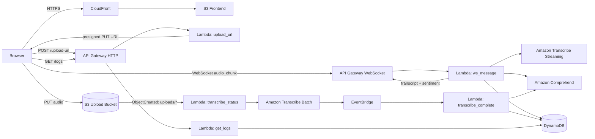

# Signal — AWS Audio Transcription & Sentiment

[](https://aws.amazon.com/)
[](https://www.python.org/)
[](infra/template.yaml)
[](#deployment-status)

**Signal** is a fully serverless audio transcription and sentiment-analysis application built on AWS. It supports both **near-real-time microphone transcription** over WebSockets and **asynchronous file transcription**, with sentiment scoring and persistent session logs.

The browser frontend is served through **Amazon CloudFront**, while the backend is composed entirely of managed AWS services—API Gateway, Lambda, Transcribe, Comprehend, S3, DynamoDB, and EventBridge.

## What it does

- **Live microphone mode** — captures browser microphone audio and sends short PCM chunks over a WebSocket connection.
- **Near-real-time transcription** — each chunk is processed with Amazon Transcribe Streaming and returned to the browser.
- **Sentiment analysis** — final transcript segments are scored with Amazon Comprehend.
- **Session transcript** — transcript fragments are accumulated for the active WebSocket connection and summarized when the session ends.
- **Audio file upload** — files are uploaded directly to S3 through a presigned URL.
- **Asynchronous batch transcription** — S3 events start Amazon Transcribe jobs and EventBridge handles completion.
- **Persistent activity feed** — transcript and sentiment results are stored in DynamoDB and exposed through a lightweight HTTP API.
- **Serverless frontend delivery** — static assets are hosted privately in S3 and served over HTTPS through CloudFront.

## Architecture



### Live microphone flow

```text
Browser microphone
  → API Gateway WebSocket
  → ws_message Lambda
  → Amazon Transcribe Streaming
  → Amazon Comprehend
  → DynamoDB
  → transcript + sentiment back to browser
```

### File upload flow

```text
Browser
  → POST /upload-url
  → presigned S3 PUT
  → S3 ObjectCreated (uploads/ only)
  → transcribe_status Lambda
  → Amazon Transcribe batch job
  → EventBridge completion event
  → transcribe_complete Lambda
  → Comprehend + DynamoDB
  → GET /logs
```

> The live path is intentionally **chunked near-real-time transcription**, not one long-lived Transcribe stream for the entire browser session.

## AWS services

| Service | Purpose |
|---|---|
| **Amazon CloudFront** | HTTPS delivery for the static frontend |
| **Amazon S3** | Frontend assets, uploaded audio, and batch-transcription output |
| **Amazon API Gateway** | HTTP endpoints and WebSocket transport |
| **AWS Lambda** | Stateless application logic |
| **Amazon Transcribe** | Streaming and batch speech-to-text |
| **Amazon Comprehend** | Text sentiment analysis |
| **Amazon DynamoDB** | WebSocket connection state and transcription logs |
| **Amazon EventBridge** | Transcribe job completion events |
| **AWS SAM / CloudFormation** | Reproducible infrastructure definition |

## Lambda functions

| Function | Trigger | Responsibility |
|---|---|---|
| `ws_connect` | WebSocket `$connect` | Creates connection state in DynamoDB |
| `ws_disconnect` | WebSocket `$disconnect` | Finalizes the session summary and removes connection state |
| `ws_message` | WebSocket `audio_chunk` | Transcribes audio, scores sentiment, stores results, and replies to the client |
| `upload_url` | `POST /upload-url` | Generates a presigned S3 upload URL |
| `transcribe_status` | S3 `ObjectCreated` under `uploads/` | Starts an asynchronous Transcribe job |
| `transcribe_complete` | EventBridge | Processes completed/failed Transcribe jobs and stores results |
| `get_logs` | `GET /logs` | Returns recent transcription log entries |

## Repository structure

```text
.
├── frontend/
│   ├── app.js
│   ├── config.example.js
│   └── index.html
├── infra/
│   └── template.yaml
├── lambdas/
│   ├── get_logs/
│   ├── transcribe_complete/
│   ├── transcribe_status/
│   ├── upload_url/
│   ├── ws_connect/
│   ├── ws_disconnect/
│   └── ws_message/
├── .gitignore
└── README.md
```

## Frontend configuration

Runtime API endpoints are intentionally excluded from source control.

Copy the example configuration:

```powershell
Copy-Item .\frontend\config.example.js .\frontend\config.js
```

Then set the values returned by your deployed stack:

```javascript
window.APP_CONFIG = {
  WEBSOCKET_URL: "wss://YOUR_WEBSOCKET_API_ID.execute-api.YOUR_REGION.amazonaws.com/prod",
  REST_API_URL: "https://YOUR_HTTP_API_ID.execute-api.YOUR_REGION.amazonaws.com/prod"
};
```

`frontend/config.js` is ignored by Git so deployment-specific endpoints do not get committed accidentally.

## Infrastructure

The infrastructure definition lives in [`infra/template.yaml`](infra/template.yaml).

It provisions the application architecture including:

- DynamoDB connection and log tables
- TTL cleanup for WebSocket connection records
- encrypted S3 buckets
- seven Lambda functions
- HTTP and WebSocket APIs
- S3-to-Lambda notification filtering on `uploads/`
- EventBridge handling for Transcribe job completion
- scoped Lambda permissions
- a private frontend S3 origin
- CloudFront with Origin Access Control

### Validate

```powershell
sam validate --template-file .\infra\template.yaml
```

The current template passes basic AWS SAM validation.

### Build

`ws_message` depends on `amazon-transcribe` and `awscrt`. Because `awscrt` contains native components, build the Lambda package in a Linux-compatible environment (for example Linux/WSL or a SAM build container) before deploying it.

```powershell
sam build --use-container --template-file .\infra\template.yaml
```

### Deploy

After a successful build:

```powershell
sam deploy --guided
```

The template exposes CloudFormation outputs for the HTTP API URL, WebSocket URL, CloudFront frontend URL, bucket names, and DynamoDB table names.

## Deployment status

A working version of the application has been deployed on AWS with the frontend delivered through CloudFront and the backend running on the serverless architecture documented above.

The SAM template in this repository was reconstructed from that deployment and has passed `sam validate`. A fresh containerized `sam build` / clean-stack deployment has **not** been verified as part of this repository release.

## Security and portability

Before publishing this repository, the source was cleaned to avoid embedding deployment-specific values.

- AWS account IDs and API IDs are not hardcoded.
- Bucket and table names are injected through environment variables.
- AWS region is obtained from the Lambda runtime environment.
- `frontend/config.js` is excluded from Git.
- No AWS access keys, session tokens, private keys, or obvious API-key/password patterns were detected in the final source scan.
- The frontend S3 bucket defined by SAM is private and accessed through CloudFront Origin Access Control.

## Notes and limitations

- Live transcription is implemented as short independent streaming chunks rather than one persistent Transcribe connection.
- `get_logs` is designed for demo-scale usage and scans DynamoDB rather than using a paginated/query-oriented access pattern.
- The APIs currently use permissive CORS / unauthenticated routes suitable for a demonstration project; production use should add authentication and tighter origin restrictions.
- Amazon Transcribe, Comprehend, Lambda, API Gateway, DynamoDB, S3, and CloudFront are usage-billed AWS services; actual cost depends on region and workload.

## Tech stack

`Python 3.12` · `JavaScript` · `AWS Lambda` · `API Gateway WebSocket/HTTP` · `Amazon Transcribe` · `Amazon Comprehend` · `DynamoDB` · `S3` · `EventBridge` · `CloudFront` · `AWS SAM`
