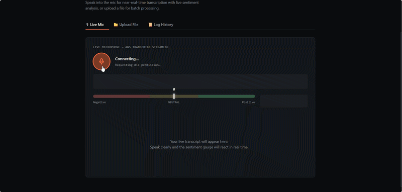
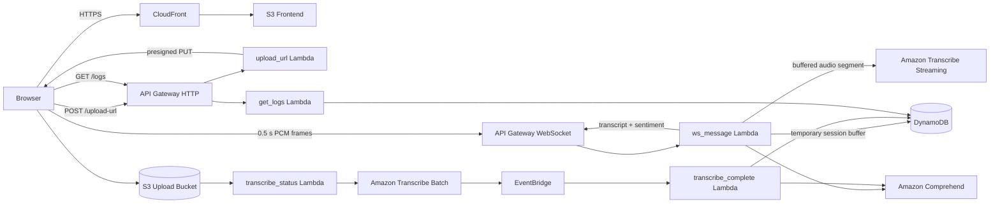

# Signal — AWS Audio Transcription & Sentiment

**Signal** is a serverless AWS application for live microphone transcription, sentiment analysis, and asynchronous audio-file transcription.

The project uses **API Gateway WebSockets, AWS Lambda, Amazon Transcribe, Amazon Comprehend, DynamoDB, S3, EventBridge, and CloudFront**. The live path uses buffered near-real-time transcription rather than pretending a Lambda-based WebSocket integration is one persistent Transcribe session.

## Demo

> **Live demo video / GIF placeholder**  
> Add the final recording at `docs/demo-live.gif` or link the recorded video here.

<!-- Example once added:

-->

> **AWS architecture / console screenshot placeholder**  
> Add the selected AWS Console screenshot at `docs/aws-architecture.png`.

<!-- Example once added:

-->

## What it does

- Captures microphone audio in the browser and sends small PCM frames through API Gateway WebSockets.
- Buffers those frames into larger speech segments before sending them to Amazon Transcribe, which gives the recognizer enough context to produce useful text.
- Returns transcript segments and Amazon Comprehend sentiment results to the browser while the session is active.
- Flushes the final incomplete audio segment when recording stops so the end of a sentence is not lost.
- Accepts audio-file uploads through presigned S3 URLs and processes them asynchronously with Amazon Transcribe.
- Stores transcription and sentiment results in DynamoDB and exposes recent activity through an HTTP API.

## Architecture



### Live microphone flow

```text
Browser microphone
  → 0.5 s PCM WebSocket frames
  → ws_message Lambda
  → temporary per-connection buffer in DynamoDB
  → ~6 s buffered segment
  → Amazon Transcribe
  → Amazon Comprehend
  → transcript + sentiment returned to browser
```

When the user presses **Stop**, the browser sends any remaining local audio and requests a graceful session finish. The backend processes the remaining server-side buffer before the WebSocket is closed.

This is **buffered near-real-time transcription**, not a single long-lived Transcribe stream across the whole browser session.

### File upload flow

```text
Browser
  → request presigned upload URL
  → direct S3 upload
  → S3 event
  → start Amazon Transcribe batch job
  → EventBridge completion event
  → process transcript + sentiment
  → store result in DynamoDB
```

## Project evolution

The first working version was assembled directly in the AWS Console while I was learning how API Gateway WebSockets, Lambda, Transcribe, DynamoDB, and the browser audio pipeline behave together.

The original live-transcription implementation treated every small WebSocket audio message as an independent Transcribe session. That kept the integration simple, but the speech recognizer had almost no surrounding context. In practice, words were skipped or misinterpreted and the result was not useful as a continuous transcript.

The live path was then changed so the browser still sends small frames that stay within API Gateway WebSocket limits, while Lambda persists them temporarily by connection and sends a larger buffered segment to Transcribe. This produced a large improvement in transcript continuity without replacing the existing serverless architecture.

A second issue appeared at session shutdown: if the user stopped recording while the final segment was still incomplete or being processed, the WebSocket could close before the last text returned. The stop flow was changed to perform a graceful drain and close only after the backend finishes the remaining audio.

The infrastructure was later documented in AWS SAM so the architecture is represented as code rather than existing only as manually configured cloud resources.

## Issues faced and solved

### 1. Very poor live transcription across short chunks

**Problem:** The browser sent small audio frames and each frame opened a new Transcribe Streaming session. Each request was valid on its own, but Transcribe repeatedly lost linguistic context at chunk boundaries.

**Fix:** Keep the small WebSocket transport frames, accumulate them into a larger per-connection audio buffer, and transcribe the combined segment. This preserved the API Gateway transport while giving Transcribe substantially more context.

### 2. WebSocket payload-size constraint

**Problem:** Sending a complete multi-second raw PCM segment as one JSON WebSocket message would grow beyond the practical API Gateway frame limit.

**Fix:** Transport remains split into roughly 0.5-second PCM frames. Buffering happens behind the WebSocket boundary instead of making the client send one large message.

### 3. Final words lost when recording stopped

**Problem:** The original frontend closed the WebSocket shortly after Stop. A partially filled buffer, or a Transcribe request already in progress, could finish after the connection disappeared.

**Fix:** Stop now becomes a graceful finish operation: local audio is flushed, microphone capture ends, the socket stays open, the backend drains the final buffer, and only then does the session close.

### 4. DynamoDB transcript concatenation failure

**Problem:** An early helper attempted to concatenate DynamoDB string attributes with `+` inside an update expression. DynamoDB treats `+` as numeric addition, causing a `ValidationException` after transcription had already succeeded.

**Fix:** Transcript segments are stored as a list and appended using DynamoDB `list_append`, then joined when the cumulative transcript is needed.

### 5. Lambda state does not survive WebSocket messages

**Problem:** API Gateway maintains the client WebSocket connection, but each route message can invoke a separate Lambda execution. In-memory session state therefore cannot be relied on between audio messages.

**Fix:** Per-connection state, transcript fragments, and temporary audio-buffer state are persisted in DynamoDB.

## AWS services

| Service | Role |
|---|---|
| CloudFront | HTTPS delivery of the frontend |
| S3 | Static frontend, audio uploads, batch-transcription data |
| API Gateway | HTTP API and WebSocket transport |
| Lambda | Application and event-processing logic |
| Amazon Transcribe | Live buffered and batch speech-to-text |
| Amazon Comprehend | Sentiment analysis |
| DynamoDB | Connection state, temporary live-session state, logs |
| EventBridge | Batch Transcribe completion handling |
| AWS SAM | Infrastructure definition |

## Lambda functions

| Function | Responsibility |
|---|---|
| `ws_connect` | Creates WebSocket connection state |
| `ws_message` | Buffers live audio, transcribes segments, analyzes sentiment, and responds to the browser |
| `ws_disconnect` | Final session cleanup and summary handling |
| `upload_url` | Generates presigned S3 upload URLs |
| `transcribe_status` | Starts asynchronous Transcribe jobs after upload |
| `transcribe_complete` | Processes completed batch jobs |
| `get_logs` | Returns recent transcription activity |

## Repository structure

```text
.
├── frontend/
│   ├── app.js
│   ├── config.example.js
│   └── index.html
├── infra/
│   └── template.yaml
├── lambdas/
│   ├── get_logs/
│   ├── transcribe_complete/
│   ├── transcribe_status/
│   ├── upload_url/
│   ├── ws_connect/
│   ├── ws_disconnect/
│   └── ws_message/
├── docs/                  # demo media / AWS screenshots
└── README.md
```

## Configuration

Runtime API endpoints are kept out of source control.

```powershell
Copy-Item .\frontend\config.example.js .\frontend\config.js
```

Then configure the deployed endpoints:

```javascript
window.APP_CONFIG = {
  WEBSOCKET_URL: "wss://YOUR_WEBSOCKET_API_ID.execute-api.YOUR_REGION.amazonaws.com/prod",
  REST_API_URL: "https://YOUR_HTTP_API_ID.execute-api.YOUR_REGION.amazonaws.com/prod"
};
```

`frontend/config.js` is ignored by Git.

## Infrastructure

The AWS SAM definition is in [`infra/template.yaml`](infra/template.yaml).

```powershell
sam validate --template-file .\infra\template.yaml
```

The template has passed basic SAM validation. The deployed application was built and iterated on directly in AWS before the infrastructure was reconstructed in SAM, so a fresh clean-stack deployment from the template has not been claimed as verified.

`ws_message` uses `amazon-transcribe` and `awscrt`; builds should therefore be produced in a Linux-compatible environment when packaging the Lambda dependencies.

## Limitations

- The live path is buffered near-real-time transcription rather than one persistent Amazon Transcribe session.
- DynamoDB is used for short-lived live-session buffering because it fits this serverless design; it is not intended as general-purpose audio storage.
- `get_logs` is demo-scale and scans recent log data rather than implementing a production query/pagination model.
- The current APIs are designed for a portfolio/demo deployment and would need stronger authentication and origin restrictions for public production use.
- AWS service usage is billable and depends on region and workload.

## Tech stack

`Python 3.12` · `JavaScript` · `AWS Lambda` · `API Gateway` · `Amazon Transcribe` · `Amazon Comprehend` · `DynamoDB` · `S3` · `EventBridge` · `CloudFront` · `AWS SAM`
