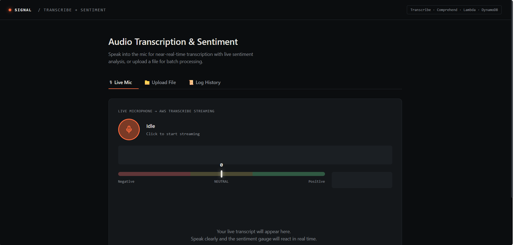
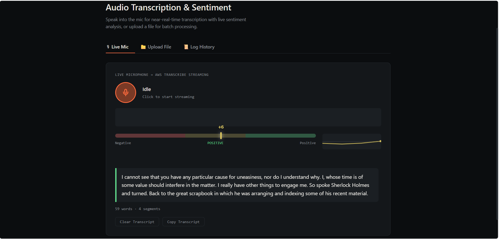
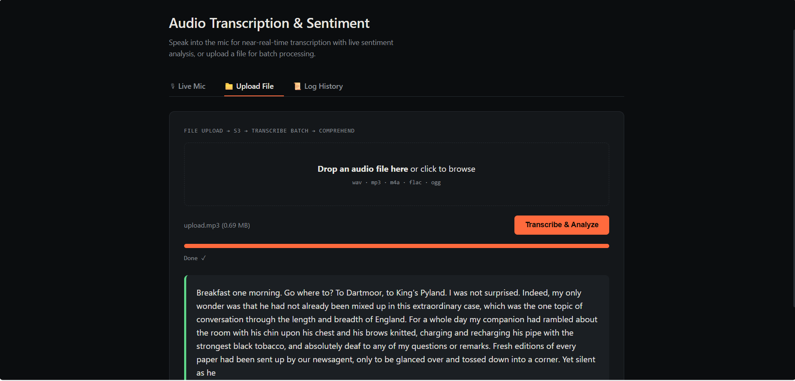
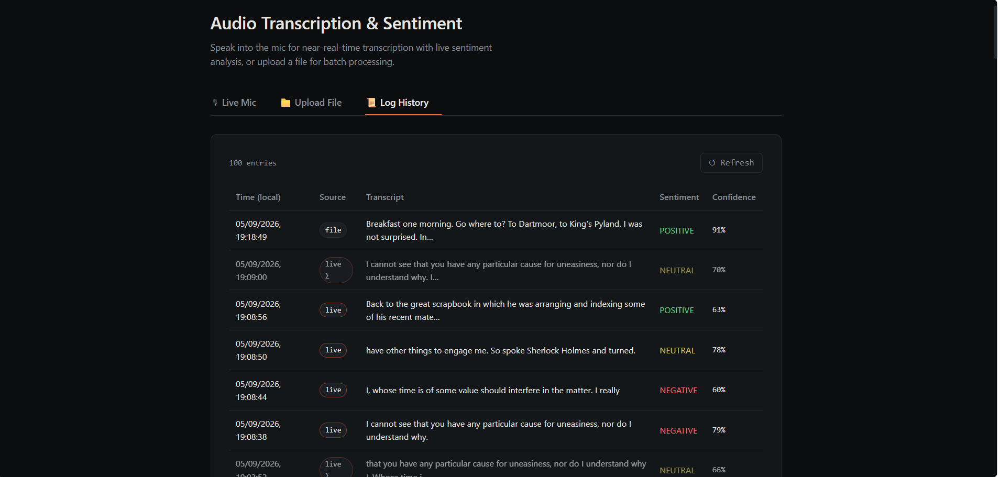
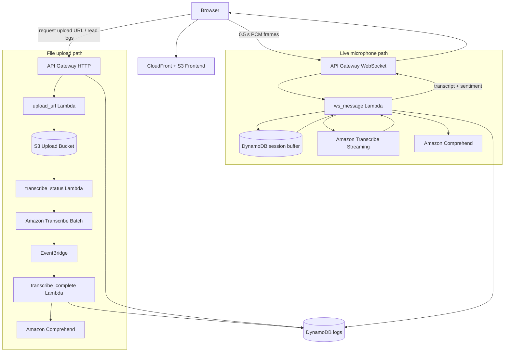

# Signal — AWS Audio Transcription & Sentiment

**Signal** is a serverless AWS application for live microphone transcription, sentiment analysis, and asynchronous audio-file transcription.

The project uses **API Gateway WebSockets, AWS Lambda, Amazon Transcribe, Amazon Comprehend, DynamoDB, S3, EventBridge, and CloudFront**. The live path uses buffered near-real-time transcription rather than treating each small WebSocket frame as an independent speech-recognition session.

## Demo

### Live transcription

> **GIF placeholder** — add `docs/demo-live.gif`

<!-- Once the GIF is added, replace the placeholder above with:

-->

Shows the browser microphone path, buffered transcription arriving in segments, live sentiment updates, and the graceful final flush when recording stops.

### File upload transcription

> **GIF placeholder** — add `docs/demo-upload.gif`

<!-- Once the GIF is added, replace the placeholder above with:

-->

Shows audio upload, asynchronous batch transcription, sentiment analysis, and the completed result in the UI.

### Interface screenshots

The final README can also include these supporting screenshots:

| View | Suggested file |
|---|---|
| Live microphone — idle | `docs/live-idle.png` |
| Live microphone — transcript + sentiment | `docs/live-result.png` |
| File upload — completed transcription | `docs/upload-result.png` |
| Log history | `docs/log-history.png` |

<!-- Suggested gallery after the images are added:
<table>
  <tr>
    <td></td>
    <td></td>
  </tr>
  <tr>
    <td></td>
    <td></td>
  </tr>
</table>
-->

## What it does

- Captures microphone audio in the browser and sends small PCM frames through API Gateway WebSockets.
- Buffers those frames into larger speech segments before sending them to Amazon Transcribe.
- Returns transcript segments and Amazon Comprehend sentiment results while the live session is active.
- Flushes the final incomplete audio segment before closing the WebSocket when recording stops.
- Accepts audio-file uploads through presigned S3 URLs and processes them asynchronously with Amazon Transcribe.
- Stores transcription and sentiment results in DynamoDB and exposes recent activity through an HTTP API.

## Architecture



### Live microphone flow

```text
Browser microphone
  → 0.5 s PCM WebSocket frames
  → ws_message Lambda
  → temporary per-connection buffer in DynamoDB
  → ~6 s buffered segment
  → Amazon Transcribe
  → Amazon Comprehend
  → transcript + sentiment returned to browser
```

When **Stop** is pressed, the browser flushes any remaining local audio and requests a graceful finish. The backend processes the remaining server-side buffer before the WebSocket closes.

This is **buffered near-real-time transcription**, not one long-lived Transcribe stream across the full browser session.

### File upload flow

```text
Browser
  → request presigned upload URL
  → direct S3 upload
  → S3 event
  → start Amazon Transcribe batch job
  → EventBridge completion event
  → process transcript + sentiment
  → store result in DynamoDB
```

## Project evolution

The first working version was built directly in the AWS Console to get the end-to-end serverless flow working. The live path initially opened a new Transcribe session for every small WebSocket audio frame; it worked technically, but the transcript lost too much context to be useful.

The live path was then changed to preserve the small transport frames while buffering them into larger segments before transcription. A graceful stop flow was added so the final partial segment is not lost, and the deployed architecture was later documented in AWS SAM.

## AWS services

| Service | Role |
|---|---|
| CloudFront | HTTPS delivery of the frontend |
| S3 | Static frontend, audio uploads, batch-transcription data |
| API Gateway | HTTP API and WebSocket transport |
| Lambda | Application and event-processing logic |
| Amazon Transcribe | Live buffered and batch speech-to-text |
| Amazon Comprehend | Sentiment analysis |
| DynamoDB | Connection state, temporary live-session state, logs |
| EventBridge | Batch Transcribe completion handling |
| AWS SAM | Infrastructure definition |

## Lambda functions

| Function | Responsibility |
|---|---|
| `ws_connect` | Creates WebSocket connection state |
| `ws_message` | Buffers live audio, transcribes segments, analyzes sentiment, and responds to the browser |
| `ws_disconnect` | Final session cleanup and summary handling |
| `upload_url` | Generates presigned S3 upload URLs |
| `transcribe_status` | Starts asynchronous Transcribe jobs after upload |
| `transcribe_complete` | Processes completed batch jobs |
| `get_logs` | Returns recent transcription activity |

## Repository structure

```text
.
├── frontend/
│   ├── app.js
│   ├── config.example.js
│   └── index.html
├── infra/
│   └── template.yaml
├── lambdas/
│   ├── get_logs/
│   ├── transcribe_complete/
│   ├── transcribe_status/
│   ├── upload_url/
│   ├── ws_connect/
│   ├── ws_disconnect/
│   └── ws_message/
├── docs/                  # demo media / screenshots
└── README.md
```

## Configuration

Runtime API endpoints are kept out of source control.

```powershell
Copy-Item .\frontend\config.example.js .\frontend\config.js
```

Then configure the deployed endpoints:

```javascript
window.APP_CONFIG = {
  WEBSOCKET_URL: "wss://YOUR_WEBSOCKET_API_ID.execute-api.YOUR_REGION.amazonaws.com/prod",
  REST_API_URL: "https://YOUR_HTTP_API_ID.execute-api.YOUR_REGION.amazonaws.com/prod"
};
```

`frontend/config.js` is ignored by Git.

## Infrastructure

The AWS SAM definition is in [`infra/template.yaml`](infra/template.yaml).

```powershell
sam validate --template-file .\infra\template.yaml
```

The template has passed basic SAM validation. The deployed application was built and iterated on directly in AWS before the infrastructure was reconstructed in SAM, so a fresh clean-stack deployment from the template has not been claimed as verified.

`ws_message` uses `amazon-transcribe` and `awscrt`; builds should therefore be produced in a Linux-compatible environment when packaging the Lambda dependencies.

## Issues faced and solved

| Issue | Resolution |
|---|---|
| Short independent Transcribe sessions skipped or misread words | Kept 0.5 s WebSocket transport frames but buffered them into ~6 s segments before transcription |
| Large PCM messages would exceed practical WebSocket payload limits | Kept buffering on the backend instead of increasing client message size |
| Final words could disappear when the user stopped recording | Added a graceful finish flow that drains the remaining buffer before closing the socket |
| DynamoDB string concatenation caused a `ValidationException` | Stored transcript fragments as a list and used `list_append` |
| Lambda executions cannot rely on in-memory state between WebSocket messages | Persisted per-connection transcript and temporary audio state in DynamoDB |

## Limitations

- The live path is buffered near-real-time transcription rather than one persistent Amazon Transcribe session.
- DynamoDB is used for short-lived live-session buffering because it fits this serverless design; it is not intended as general-purpose audio storage.
- `get_logs` is demo-scale and scans recent log data rather than implementing a production query/pagination model.
- The current APIs are designed for a portfolio/demo deployment and would need stronger authentication and origin restrictions for public production use.
- AWS service usage is billable and depends on region and workload.

## Tech stack

`Python 3.12` · `JavaScript` · `AWS Lambda` · `API Gateway` · `Amazon Transcribe` · `Amazon Comprehend` · `DynamoDB` · `S3` · `EventBridge` · `CloudFront` · `AWS SAM`
