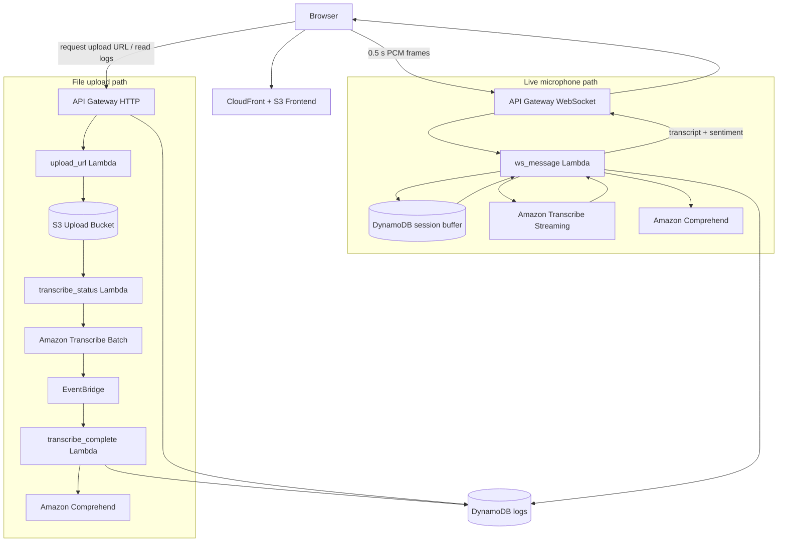

# Signal — AWS Audio Transcription & Sentiment

**Signal** is a serverless AWS application for live microphone transcription, sentiment analysis, and asynchronous audio-file transcription.

It combines **API Gateway WebSockets, AWS Lambda, Amazon Transcribe, Amazon Comprehend, DynamoDB, S3, EventBridge, and CloudFront** into two working paths: a near-real-time microphone flow and a batch upload flow.

## Demo

### Live transcription


The live demo shows microphone audio moving through the WebSocket path, transcription arriving in buffered segments, sentiment updates, and the final transcript completing when recording stops.

### File upload transcription


**[Sample audio used for the upload demo](docs/demo-upload.mp3)**

The sample is uploaded directly to S3 with a presigned URL, processed asynchronously with Amazon Transcribe, analyzed with Amazon Comprehend, and displayed in the frontend after completion.

### Interface

<table>
  <tr>
    <td align="center"><strong>Live microphone — idle</strong><br></td>
    <td align="center"><strong>Live transcript + sentiment</strong><br></td>
  </tr>
  <tr>
    <td align="center"><strong>File transcription result</strong><br></td>
    <td align="center"><strong>Log history</strong><br></td>
  </tr>
</table>

## Project snapshot

| Area | Implementation |
|---|---|
| Live audio transport | API Gateway WebSockets with 0.5 s PCM frames |
| Session handling | Per-connection state and temporary audio buffering in DynamoDB |
| Speech recognition | Amazon Transcribe Streaming for buffered live segments |
| Sentiment | Amazon Comprehend |
| File workflow | Presigned S3 upload → Transcribe batch → EventBridge completion |
| Persistence | DynamoDB transcription/sentiment logs |
| Frontend | Browser microphone capture + CloudFront/S3 hosting |
| Infrastructure | AWS SAM definition in `infra/template.yaml` |

---

## What it does

- Captures microphone audio in the browser and sends small PCM frames through API Gateway WebSockets.
- Buffers those transport frames into larger speech segments before sending them to Amazon Transcribe.
- Returns transcript segments and Amazon Comprehend sentiment results while the session is active.
- Flushes the remaining audio segment when recording stops so final words are not dropped.
- Accepts audio-file uploads through presigned S3 URLs and processes them asynchronously with Amazon Transcribe.
- Stores transcription and sentiment results in DynamoDB and exposes recent activity through an HTTP API.

---

## Architecture



### Live microphone path

```text
Browser microphone
  → 0.5 s PCM WebSocket frames
  → ws_message Lambda
  → per-connection DynamoDB buffer
  → ~6 s speech segment
  → Amazon Transcribe
  → Amazon Comprehend
  → transcript + sentiment returned to browser
```

The small WebSocket frames keep transport responsive and within practical payload sizes, while backend buffering gives Transcribe more speech context than treating every transport frame as its own recognition session.

When **Stop** is pressed, the browser flushes remaining local audio and requests a graceful finish. The backend then processes the remaining server-side buffer before closing the session.

### File upload path

```text
Browser
  → request presigned upload URL
  → direct S3 upload
  → S3 event
  → start Amazon Transcribe batch job
  → EventBridge completion event
  → process transcript + sentiment
  → store result in DynamoDB
```

---

## Main engineering decisions

### Buffering across stateless Lambda invocations

API Gateway WebSocket messages can be handled by separate Lambda invocations, so the live path cannot rely on process memory to preserve an audio session. The project stores per-connection transcript state and temporary PCM data in DynamoDB, allowing later messages to continue the same session.

### Separating transport size from transcription context

The first working version opened a new Transcribe session for every small WebSocket audio frame. It functioned end to end, but the short independent recognition windows lost too much context.

The current design keeps the 0.5-second client transport frames while collecting them into roughly 6-second backend segments before transcription. This improved the practical usefulness of the live transcript without increasing individual WebSocket payload size.

### Graceful session completion

Stopping a recording can leave a partial segment below the normal buffer threshold. The finish path explicitly drains that remaining audio so the final words have a chance to be transcribed before the connection is cleaned up.

### Separate live and batch workflows

Live microphone sessions prioritize incremental feedback. Uploaded files use the asynchronous Transcribe batch path and EventBridge completion events instead, which fits longer-running processing without keeping a client request open.

---

## Issues faced and solved

| Issue | Resolution |
|---|---|
| Short independent Transcribe sessions skipped or misread words | Kept 0.5 s WebSocket transport frames but buffered them into ~6 s segments before transcription |
| Large PCM messages would exceed practical WebSocket payload limits | Kept buffering on the backend instead of increasing client message size |
| Final words could disappear when recording stopped | Added a graceful finish flow that drains the remaining buffer before closing the socket |
| DynamoDB string concatenation caused a `ValidationException` | Stored transcript fragments as a list and used `list_append` |
| Lambda executions cannot rely on in-memory state between WebSocket messages | Persisted per-connection transcript and temporary audio state in DynamoDB |

---

## AWS services

| Service | Role |
|---|---|
| CloudFront | HTTPS delivery of the frontend |
| S3 | Static frontend, audio uploads, batch-transcription data |
| API Gateway | HTTP API and WebSocket transport |
| Lambda | Application and event-processing logic |
| Amazon Transcribe | Buffered live and batch speech-to-text |
| Amazon Comprehend | Sentiment analysis |
| DynamoDB | Connection state, temporary live-session state, logs |
| EventBridge | Batch Transcribe completion handling |
| AWS SAM | Infrastructure definition |

---

## Lambda functions

| Function | Responsibility |
|---|---|
| `ws_connect` | Creates WebSocket connection state |
| `ws_message` | Buffers live audio, transcribes segments, analyzes sentiment, and responds to the browser |
| `ws_disconnect` | Final session cleanup and summary handling |
| `upload_url` | Generates presigned S3 upload URLs |
| `transcribe_status` | Starts asynchronous Transcribe jobs after upload |
| `transcribe_complete` | Processes completed batch jobs |
| `get_logs` | Returns recent transcription activity |

---

## Repository structure

```text
.
├── frontend/
│   ├── app.js
│   ├── config.example.js
│   └── index.html
├── infra/
│   └── template.yaml
├── lambdas/
│   ├── get_logs/
│   ├── transcribe_complete/
│   ├── transcribe_status/
│   ├── upload_url/
│   ├── ws_connect/
│   ├── ws_disconnect/
│   └── ws_message/
├── docs/
└── README.md
```

---

## Configuration

Runtime API endpoints are kept out of source control.

```powershell
Copy-Item .\frontend\config.example.js .\frontend\config.js
```

Then configure the deployed endpoints:

```javascript
window.APP_CONFIG = {
  WEBSOCKET_URL: "wss://YOUR_WEBSOCKET_API_ID.execute-api.YOUR_REGION.amazonaws.com/prod",
  REST_API_URL: "https://YOUR_HTTP_API_ID.execute-api.YOUR_REGION.amazonaws.com/prod"
};
```

`frontend/config.js` is ignored by Git.

---

## Infrastructure

The AWS SAM definition is in [`infra/template.yaml`](infra/template.yaml).

```powershell
sam validate --template-file .\infra\template.yaml
```

The template has passed basic SAM validation. The deployed application itself was built and iterated on directly in AWS before the architecture was documented in SAM.

`ws_message` uses `amazon-transcribe` and `awscrt`; Lambda packages containing those dependencies should be built in a Linux-compatible environment.

---

## Scope and limitations

The microphone path is **buffered near-real-time transcription**: short WebSocket frames are accumulated into roughly 6-second segments and each segment is sent through a Transcribe streaming session. It is not one persistent Transcribe stream spanning the entire browser recording.

DynamoDB is used as short-lived session state for this serverless design rather than as general-purpose audio storage. `get_logs` is intentionally demo-scale, and the current public-facing API configuration would need stronger authentication and origin restrictions for a production deployment. AWS service usage is billable and varies by region and workload.

These boundaries keep the project focused on the serverless audio/session problem it was built to demonstrate rather than expanding it into a production communications platform.

---

## Tech stack

`Python 3.12` · `JavaScript` · `AWS Lambda` · `API Gateway` · `Amazon Transcribe` · `Amazon Comprehend` · `DynamoDB` · `S3` · `EventBridge` · `CloudFront` · `AWS SAM`
